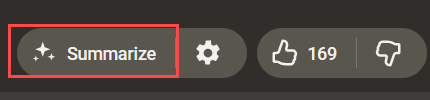

# YouTube Free AI Summary

[](README.md)
[](README.zh-TW.md)

---

**YouTube Free AI Summary** adds a button to YouTube that grabs the current video's subtitles and drops them straight into a freshly opened AI chat — your choice of Google AI Studio, Gemini, ChatGPT, Claude, or Grok — ready to be summarized.

It is built to solve the two problems other summary scripts run into: they can't get the subtitles of restricted videos, and long transcripts don't reach the AI in one piece, so you end up with a summary of only part of the video.



Once installed, a **Summarize** button (outlined in red) appears next to the like / dislike buttons on the video page. One press and it starts.

## Features

- **Completely free** — No API key, no payment, no subscription; you only need to be logged into the AI service you picked
- **One click** — Adds a button to the YouTube video page: press it and the subtitles are captured, your AI opens, and the summary starts
- **Choice of AI service** — Google AI Studio, Gemini, ChatGPT, Claude, or Grok — pick your usual one in the settings
- **Works on restricted videos** — Members-only, age-restricted and region-locked videos can be summarized too, as long as you can watch them yourself
- **Long videos aren't cut short** — The whole transcript reaches the AI, so the summary won't stop halfway through
- **Summarize without opening the video** — Hover any video thumbnail for a button that summarizes it right there
- **Custom prompt** — Write your own prompt in the settings to control how the AI summarizes and what it focuses on

## Installation

Two steps: first install a userscript manager, then install this script. Everything is free and takes about a minute.

### Step 1: Install a userscript manager

Go to the [Tampermonkey](https://www.tampermonkey.net/) site, pick the browser you use, and press the "Add to Chrome" (or equivalent) button. Once it's installed, a new icon appears in the top-right corner of your browser.

If you already have another userscript manager, just keep using it.

### Step 2: Install this script

Open the [script's page on GreasyFork](https://greasyfork.org/scripts/589075-youtubefreeaisummary) and press "Install this script". The manager you just installed pops up an install screen — press its **Install** button and you're done.

You can also install the `.user.js` from this repo's `dist/` directly.

### Using it

1. Open any YouTube video **that has subtitles** (no subtitles means there's nothing to summarize)
2. Find the **Summarize** button next to the like / dislike buttons — the spot outlined in red in the screenshot above
3. Press it: the subtitles are captured and a new tab opens with the prompt already typed in, so all you do is wait for the AI's reply
4. If you aren't signed in to that AI site yet, sign in once — a normal free account is enough, no API key and no payment
5. To switch to a different AI or change any setting, press the gear next to the Summarize button

## Roadmap

Planned features and fixes:

- **Browser extension version** — a packaged browser extension in addition to the userscript

## Development

```bash
# Install dependencies
npm install

# Development mode with live reload
npm run dev

# Production build (all platforms)
npm run build-prod
```

## License

This project is licensed under the [MIT License](./LICENSE.txt).
