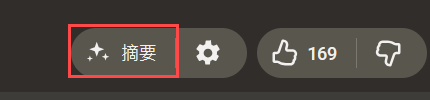

# YouTube Free AI Summary

[](README.md)
[](README.zh-TW.md)

---

**YouTube Free AI Summary** 會在 YouTube 上增加一個按鈕，擷取目前影片的字幕，並直接丟進新開的 AI 對話分頁——可自由選擇 Google AI Studio、Gemini、ChatGPT、Claude 或 Grok——讓你立刻進行總結。

它專門解決其他總結腳本會遇到的兩個問題：抓不到受限影片的字幕，以及字幕太長時沒能完整送進 AI、摘要只做了一半。



安裝後，影片頁的喜歡／不喜歡按鈕旁會出現**摘要**按鈕（紅框處），按一下就開始。

## 功能特色

- **完全免費** — 不需要 API 金鑰、不需付費、也不需訂閱，你只要已登入所選的 AI 服務
- **一鍵完成** — 在 YouTube 影片頁多一顆按鈕，按下就會擷取字幕、開好 AI，摘要立刻開始
- **可選擇 AI 服務** — Google AI Studio、Gemini、ChatGPT、Claude 或 Grok，在設定中挑你慣用的那一個
- **受限影片也能摘要** — 會員專屬、年齡限制、地區限定的影片，只要你自己看得到就摘要得了
- **再長的影片也不會被截斷** — 完整字幕都會送進 AI，不會摘要到一半就停住
- **在觀看頁面外摘要** — 滑鼠移到任何影片縮圖就會浮現按鈕，不必開啟影片也能摘要
- **自訂提示詞** — 可在設定中自訂提示詞，決定 AI 要怎麼整理、著重講什麼

## 安裝方式

總共兩步：先安裝使用者腳本管理器，再安裝本腳本。全部免費，過程約一分鐘。

### 第 1 步：安裝使用者腳本管理器

前往 [Tampermonkey](https://www.tampermonkey.net/) 官網，選擇你使用的瀏覽器，按下「加到 Chrome」之類的按鈕即可。裝好後瀏覽器右上角會多出一個圖示。

已經有其他使用者腳本管理器的話，直接沿用即可。

### 第 2 步：安裝本腳本

前往 [GreasyFork 上的腳本頁面](https://greasyfork.org/zh-TW/scripts/589075-youtubefreeaisummary)，按下「安裝腳本」，剛才裝好的管理器就會跳出一個安裝畫面，再按下上面的**安裝**按鈕即完成。

也可以直接安裝本 repo `dist/` 內的 `.user.js`。

### 開始使用

1. 打開任何一部**有字幕**的 YouTube 影片（沒有字幕就沒有東西可以摘要）
2. 在喜歡／不喜歡按鈕旁邊找到**摘要**按鈕，也就是上圖紅框的位置
3. 按下去，腳本會擷取字幕並開啟一個新分頁，提示詞已經幫你打好，接著等 AI 回覆即可
4. 如果那個 AI 網站還沒登入，先登入一次就好（一般免費帳號即可，不需要 API 金鑰或付費）
5. 想換別的 AI 或調整設定，按摘要按鈕旁邊的齒輪

## 開發藍圖

規劃中的功能與修復：

- **擴充元件版本** — 除了 userscript，另提供打包的瀏覽器擴充功能

## 開發

```bash
# 安裝依賴
npm install

# 開發模式（含熱重載）
npm run dev

# 生產建置（所有平台）
npm run build-prod
```

## 授權

本專案採用 [MIT License](./LICENSE.txt)。
